## Introduction

Do you find yourself struggling to manage all the different kinds of module information that you have to track? Are there too 
many modules, contacts, tasks and events to remember? Well, do not worry, CAP5Buddy is here to help.

CAP5Buddy is a desktop application that helps NUS SoC students to keep track of their module details efficiently.
It helps you to centralize key module details, contacts and information while following your study progress. It is optimized for use via a Command Line Interface (CLI), while still having the 
benefits of a Graphical User Interface (GUI). If you can type fast, CAP5Buddy can help you manage your module 
details and information more efficiently than traditional GUI apps.

* Table of Contents
{:toc}

--------------------------------------------------------------------------------------------------------------------

## Quick start

1. Ensure you have Java `11` or above installed in your Computer.

1. Download the latest `CAP5Buddy.jar` from [here](https://github.com/AY2021S1-CS2103T-F12-3/tp/releases).

1. Copy the file to the folder you want to use as the _home folder_ for the CAP5Buddy application.

1. Double-click the file to start the app. The GUI similar to the one below should appear in a few seconds.  

--------------------------------------------------------------------------------------------------------------------

## Navigating the GUI

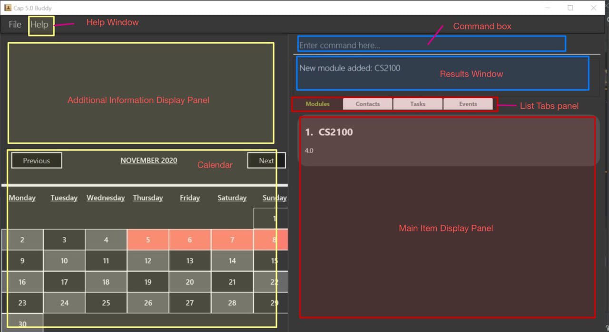

### Key Components

#### Help Window
You can click this button to open up the User Guide help window.

#### Additional Information Display Panel
This panel displays all the additional information of each item when a `view` Command is called.

#### Calendar
This is where you can view your calendar, it is as accurate as a built-in calendar and it also displays
those days that have an existing event with a color coded box.

#### Command Box
Here is where you enter your command input to be executed by the application.

#### Results Display Panel
This panel will display the status of the command, whether it passes or fails, and displays some basic information
and error messages.

#### Main Item Display Panel
Here is where all of the items that are added into the application can be found. It shows all the items as individual cell boxes.

#### List Tabs Panel
From here, you can choose between the different windows to view.

## Features

Some common symbols that can be found in the user guide and their meanings:

* :information_source: Represents useful information that should be noted.

* :bulb: Represents a useful tip.

* :warning: Represents a warning that users should be aware of.

**:information_source: Notes about the command format:** 

* Words in `UPPER_CASE` are the parameters to be supplied by you. 
  e.g. in `addtask n/NAME`, `NAME` is a parameter which can be used as `addtask n/Week 11 quiz`.

* Items in square brackets are optional. Items without square brackets are compulsory fields.  
  e.g. `addtask n/NAME [p/PRIORITY]` can be used as `addtask n/Week 11 quiz p/highest` or as `addtask n/Week 11 quiz`

* Items with `...` after them can be used multiple times, including zero times.  
  e.g. `[t/TAG]...` can be used as `   ` (i.e. 0 times), `t/easy`, `t/friend t/important` etc.

* Argument parameters can be provided in any order, unless one of the parameter is `INDEX`, in which case `INDEX`has to be the first parameter.
  e.g. if the command specifies `edittask INDEX [n/NAME] [p/PRIORITY]`, then `edittask INDEX [p/PRIORITY] [n/NAME]` is also acceptable, but
  `edittask [n/NAME] INDEX [p/PRIORITY]` is not allowed.

* If you enter duplicate parameters when the command format does not expect multiple occurrences of the same parameter, i.e.
  parameters without `...` at the back in the command format (e.g. n/NAME), the application will only consider the argument of the last
  occurring duplicate parameter.
  e.g. in `addtask n/Week 11 quiz n/Lab assignment`, `n/Week 11 quiz` will be ignored and a task with the name `Lab assignment` will be added.

### Module Tracker Features

The modules mentioned below represent a module that you would be taking as an NUS School of Computing student, such as CS2103T or CS2101.

The section below provides some useful details about the module tracker features.

####Module command parameters (Joshua)

A module tracker feature can use one or more of the following parameters:

* **`MODULE_NAME`**: (Joshua)

   * Represents the module code of the module.
  
   * Must match the module's module code exactly (i.e. capitalised and follows the same formatting).
  
   * Examples: `CS2103T`, `CS2100`
  
   * All modules must have a module name.
  

* **`MODULE_CREDITS`**: (Joshua)

   * Represents the number of modular credits this module is worth.
  
   * Modular credits should be given as a valid number and follow the typical module's number of modular credits(e.g. 4.0, 8.0).
       
   * All modules start with 4.0 modular credits on creation but the value can be edited.
   
* **`GRADE`**: (Joshua)

  * Represents the current overall grade achieved for the module.
  
  * Grades are updated automatically by the assignments (See [below](#what-is-an-assignment---assignment-joshua)).
     
* **`GRADE_POINT`**: (Joshua)

   * Represents the grade point achieved after completion of the module.
   
   * Grade point should be converted to a number (e.g A- should be converted to 4.5, B to 3.5).

* **`TAG`**: (Joshua)

  * Represents a tag that can be used to describe a module.
  
  * Tag names should be alphanumeric and should not be blank or contain whitespaces.
  
  * Examples: `Coremodule`, `Completed`
  
  * Tag is not a compulsory field of a module.
   
#### Adding a new module: `addmodule`(David, Joshua)

Creates and add a new module to be stored in the system.

  Format: `addmodule n/MODULE_NAME [t/TAG]...` 

  * You can only key in the module code for the `MODULE_NAME`. Invalid module codes, such as `CS2103TT` will not be accepted.

  * The module code you input must be **capitalised**, eg. `cs2103t` will be rejected while `CS2103T` is correct.

   Example :
   * `addmodule n/CS2103T` creates and adds the module `CS2103T`.
   
Expected Outcome: 
  

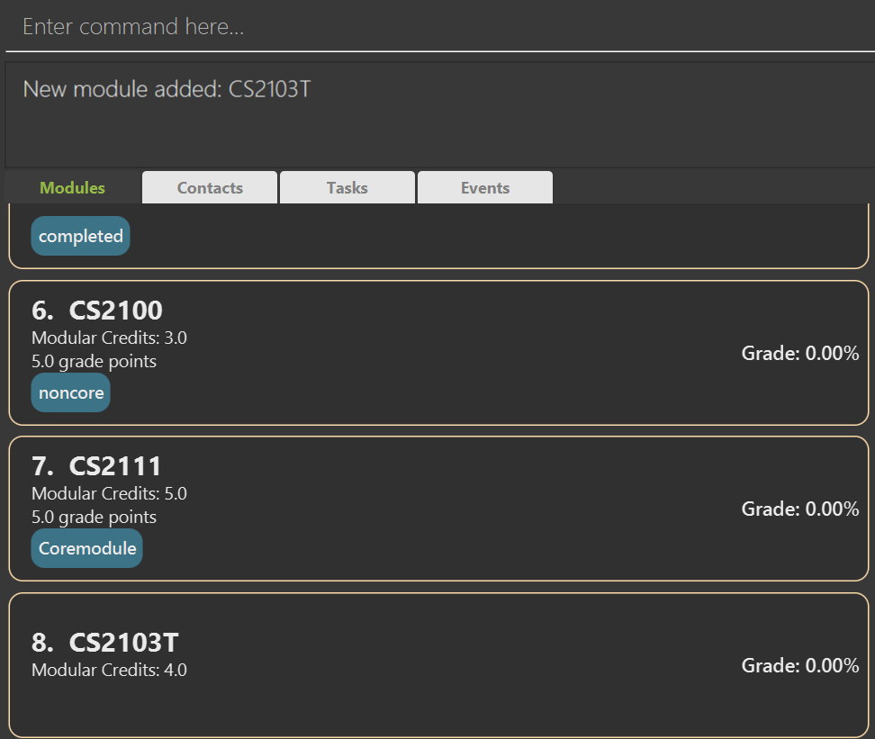

  
  Other helpful example(s):

   * `addmodule n/CS2103T t/Coremodule` creates and adds the module `CS2103T` with the tag `CoreModule`.

#### Adding a new completed module: `addcmodule`(David)

Creates and adds a new, completed module to be stored in the system.

  Format: `addcmodule n/NAME mc/MODULAR_CREDITS gp/GRADE_POINT [t/TAG]...`

   * Using this command to add a completed module will automatically tag the module as completed.
   
   * Completed modules can be modified using `editmodule`. Do note that editing tags will reset all existing tags, therefore in order to keep the completed tag after editing, you must specify the completed tag parameter in the `editmodule` command by adding `t/completed` to your command line exactly.
   
   * Completed modules added this way will be used for CAP calculation purposes.

   Examples:
   * `addcmodule n/CS2103T mc/4.0 gp/5.0` creates and adds the module named `CS2103T` with `4` modular credits
      and `5` grade points with a `completed` tag.
   * `addcmodule n/CS2101 mc/2.0 gp/4.5 t/year1` creates and adds the module named `CS2101` with `2` modular credits
      and `4.5` grade points with the tags `completed` and `year1`.

#### Viewing a module: `viewmodule`(David, Joshua)

Displays a snapshot of a module stored in the system.

 Format: `viewmodule` `INDEX`
    
  * The module viewed will be the module at the `INDEX` position of the current displayed list.

  * The index refers to the index number of the module shown on the displayed module list.

  * The index **must be a positive integer** 1, 2, 3...
  
  * Clicking on the `ZoomLink` displayed(if any) will copy the `ZoomLink` into your clipboard.
  
  * Note that the displayed snapshot is not updated when the module being displayed is changed.

  Example:
   * `viewmodule 1` views the first module in the displayed list.
   
Expected Outcome: 

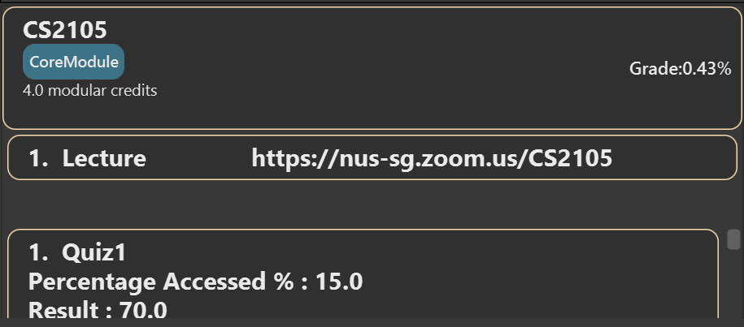

#### Archiving a module: `archivemodule`(David)

Archives a module in the module list and moves it into archived storage.

Format: `archivemodule` `INDEX`

 * The module archived will be at the `INDEX` position of the currently displayed un-archived module list.

 * The index refers to the index number of the module shown on the displayed un-archived module list.
 
 * You can only call this command when viewing the un-archived module list.

 * The index **must be a positive integer** 1, 2, 3...

 Example:
 * `archivemodule 1` archives the first module in the displayed list.
 
Expected Outcome: 
 

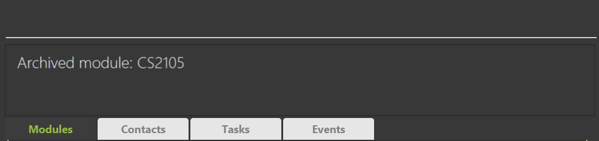

  
#### Un-archiving a module: `unarchivemodule`(David)

Un-Archives a module in the archived module list and moves it back into the current module list storage.

Format: `unarchivemodule` `INDEX`

 * The module un-archived will be at the `INDEX` position of the currently displayed archived module list.

 * The index refers to the index number of the module shown on the displayed archived module list.
 
 * You can only call this command when viewing the archived module list.

 * The index **must be a positive integer** 1, 2, 3...

 Example:
 * `unarchivemodule 1` un-archives the first module in the displayed archived module list.

#### View-archived modules: `viewarchive`(David)

Allows you to view the archived module list on the display.

Format: `viewarchive`

 * Executing this command will remove the current un-archived module list from display if you are currently viewing it. You can use the `list` command to display the un-archived module list(See next section).

 Example:
 * `viewarchive` views the archived module list on the display.

#### View un-archived modules: `listmodule`(David)

Allows you to view the un-archived module list in the display.

Format: `listmodule`

 * Executing this command will remove the current archived module list from display if you are currently viewing it. You can use the `viewarchive` command to display the archived module list(See previous section).

 Example:
 * `listmodule` views the un-archived module list on the display.

#### Locating modules: `findmodule`(David)

 Finds all modules that fulfil your provided module name search criteria.

 Format: `findmodule [MODULE_NAME_KEYWORDS...]`

  * The search is case-insensitive, e.g. `cs2030` will match `CS2030`.

  * You are allowed to provide multiple search keywords for the module name parameter.
   
  * When you are providing module name keywords, separate distinct keywords with a whitespace,
       e.g. `findmodule CS2030 CS2100` will search for contacts using the 2 distinct keywords `CS2030` and `CS2100`.
 
  * The order of the search keywords does not matter, e.g. `CS2030 CS2100` will match `CS2100 CS2030 `.

  * You should ensure that keywords are not be blank and at least one search parameter should be provided.
    
  * Search Parameters:

    * Name

      * Module with a name matching at least one of the name keywords provided will be considered to have fulfilled the module name search criteria.

      * Module name must match your search criteria exactly for module to be displayed, e.g. `cs2030` will match `CS2030` but not `CS20301`.
      

  Example:

   * `findmodule cs2030` returns the module(if any) with the module name `CS2030`.

   Expected Outcome: 
   

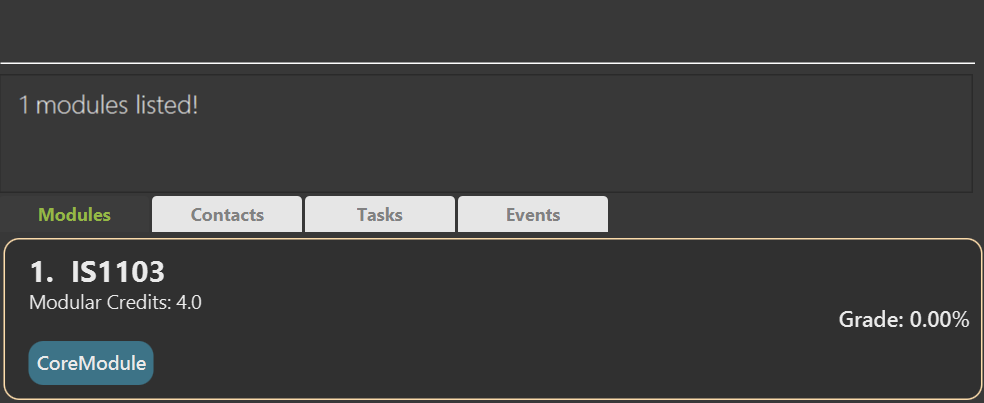

Only `CS2030` is displayed
       
  Other helpful example(s):
   
   * `findmodule cs2030 cs2100` returns the modules(if any) with the module names `CS2030` or `CS2100`.
   

#### Zoom link management feature (Jonas Ng)

The following features allow you to manage the zoom links for your respective modules and perform various zoom link related functions. 

The section below provides some useful details about the zoom list management features.

**:information_source: Note:**  
As zoom links are only displayed on the **additional information display panel**, and not the main item display panel,
to view all your zoom links, you can use the `viewmodule INDEX` command, where `INDEX` refers to the index of the module with the zoom links.

**:information_source: Note:**  
To view changes or updates made to zoom links, you should use the command `viewmodule INDEX`, where `INDEX` refers to 
the index of the module with the zoom links, after executing the zoom link command.
e.g. `addzoom 1 n/lecture z/https://nus-sg.zoom.us/j/huf7r3` followed by `viewmodule 1`
                         
**:information_source: Note:**  
Each lesson in a module will only be allowed to have one zoom link,
i.e. you will not be allowed to add multiple zoom links to the same lesson.                         

#### Zoom link command parameters (Jonas Ng)

* **`ZOOM_LINK`**:

  * Represents the zoom link of a module.
  
  * All zoom links should adhere to the following constraints:
  
    * Belong to the NUS domain and have the following format: `https://nus-sg.zoom.us/[path]`.
    
    * The zoom link path should only contain alphanumeric characters and these special characters: `?=/`, and should not be blank.
    
    * Example: `https://nus-sg.zoom.us/j/babcyg?pwd=`.

* **`LESSON_NAME`**:

  * Represents the name of a module lesson which contains the zoom link.
  
  * Lesson name should only contain alphanumeric characters, spaces and the hyphen character, and it should not be blank.

  * Example: `Lecture-weds`.

#### Adding a zoom link for a specific lesson to a module: `addzoom` (Jonas Ng)

Adds a zoom link for a specific lesson to an existing module.

**:bulb:** If you have 2 or more types of lectures in the same module, e.g. lecture on Monday and
Wednesday, and they have **different zoom links**, you can add 2 zoom links with different lesson names
e.g. `Mon-Lecture` and `Wed-Lecture`.

  Format: `addzoom INDEX n/LESSON_NAME z/ZOOM_LINK`

   * Adds a zoom link to the module at the specified `INDEX`.

   * The index refers to the index number of the module shown on the displayed module list.

   * The index **must be a positive integer** 1, 2, 3...
   
   * `LESSON_NAME` refers to the name of the module lesson which the added zoom link belongs to.

  Example(s):
  
  * `addzoom 1 n/lecture-weds z/https://nus-sg.zoom.us/j/auya7164hg` adds a zoom link `https://nus-sg.zoom.us/j/auya7164hg` to the first module
  in the displayed module list for the lesson `lecture-weds`.
  
  

  
  **:information_source: Note:**   
  To view the newly added zoom link, you have to use the `viewmodule INDEX` command after the `addzoom` command, where `INDEX` refers to the index of the module which contains the added zoom link.
  
  

  
  Expected Outcome: 
  
  
  
  Other helpful example(s):
  
  `addzoom 1 n/lecture on weds z/https://nus-sg.zoom.us/j/auya7164hg` adds a zoom link `https://nus-sg.zoom.us/j/auya7164hg` to the first module
   in the displayed module list for the lesson `lecture on weds`.

#### Editing a zoom link of a specific lesson in a module: `editzoom` (Jonas Ng)

Edits a zoom link of a specific lesson in a module.

  Format: `editzoom INDEX n/LESSON_NAME z/EDITED_ZOOM_LINK`

   * Edits the zoom link of the module at the specified `INDEX`.

   * The index refers to the index number of the module shown on the displayed module list.

   * The index **must be a positive integer** 1, 2, 3...
   
   * `LESSON_NAME` refers to the name of the lesson which the target zoom link to be edited belongs to.
   
   

   **:information_source:** 
   This command only allows you to edit the zoom link of an existing lesson in a module, i.e.
   it does not allow you to edit the name of that lesson.

   If you wish you to edit the lesson name while keeping the same zoom link, you can try the following:  
     1. Delete the zoom link that belongs to the lesson which you wish to edit.  
     2. Add the same zoom link with the edited lesson name.

   

   Example(s):
   
   `editzoom 1 n/lecture-weds z/https://nus-sg.zoom.us/editedZoom` edits the zoom link of the lesson `lecture-weds`
    in the first module to be `https://nus-sg.zoom.us/editedZoom`.

   

      
   **:information_source: Note:**   
   To view the newly edited zoom link, you have to use the `viewmodule INDEX` command after the `editzoom` command, where `INDEX` refers to the index of the module which contains the edited zoom link.
      
   

   Expected Outcome: 
   
   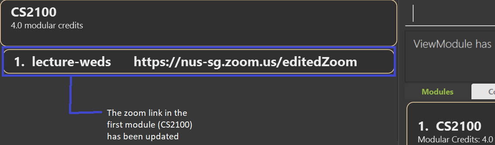
   
   Other helpful example(s):
   
   `editzoom 2 n/tutorial z/https://nus-sg.zoom.us/editedZoom` edits the zoom link of the lesson `tutorial`
    in the second module to be `https://nus-sg.zoom.us/editedZoom`.

#### Deleting a zoom link for a specific lesson from a module: `deletezoom` (Jonas Ng)

Deletes a zoom link for a specific lesson from an existing module.

  Format: `deletezoom INDEX n/LESSON_NAME`

   * Deletes a zoom link from the module at the specified `INDEX`.

   * The index refers to the index number of the module shown on the displayed module list.

   * The index **must be a positive integer** 1, 2, 3...

   * `LESSON_NAME` refers to the name of the module lesson which contains the zoom link to be deleted.

  Example(s):
  
  * `deletezoom 1 n/lecture-weds` deletes the zoom link of the lesson `lecture-weds` from the first module in the displayed module list.

  

        
  **:information_source: Note:**   
     To view the changes made, you have to use the `viewmodule INDEX` command after the `deletezoom` command, where `INDEX` refers to the index of the module which the zoom link was deleted from.
        
  

  Expected Outcome: 
  
  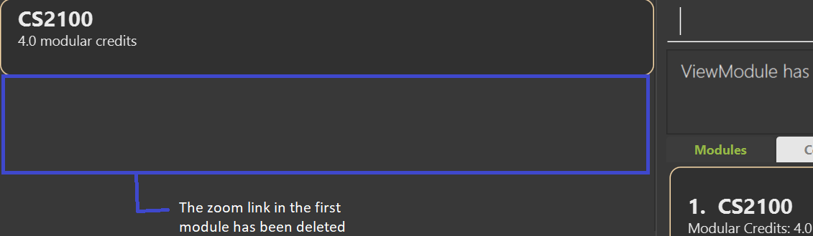
  
  Other helpful example(s):
  
  `deletezoom 2 n/tutorial G17` deletes the zoom link of the lesson `tutorial G17` from the 2nd module in the displayed module list.
  

#### Deleting a module: `deletemodule`(David, Joshua)

Deletes a module in the displayed module list.

 Format: `deletemodule` `INDEX`

   * The index **must be a positive integer** 1, 2, 3...

   * The index refers to the index number of the module shown on the displayed module list.

  Example:
  * `deletemodule 1` deletes the module at position `1`

#### Editing a module : `editmodule`(David, Joshua, Michael)

Edits an existing module in the displayed module list with new details.

 Format: `editmodule` `INDEX` `[n/MODULE_NAME]` `[mc/MODULAR_CREDITS]` `[gp/GRADE_POINT]` `[t/TAG]...`

  * Edits the details of the module at position `INDEX` with the optional fields listed.

  * The index **must be a positive integer** 1, 2, 3...

  * At least **one** of the optional fields `[MODULE_NAME]`, `[MODULAR_CREDITS]` or `[GRADE_POINT]` must be present.

  * You can add `[TAG]`s to a module through this command,eg. `Tutorial`.
   
  * You can remove all the module’s tags by typing `t/` without specifying any tags after it.

 Examples:
  * `editmodule 1 n/CS2030` edits the `MODULE_NAME` for a module at index `1` to `CS2030`.

  * `editmodule 3 mc/8 gp/4.5` edits the `MODULAR_CREDITS` and `GRADE_POINT` for the module at index `3` to `8.0`
  modular credits and the grade points to `4.5`.

#### Clearing the module list: `clearmodule`(David)

Clears all un-archived modules.

Format: `clearmodule`

* _**Tips :**_ If you accidentally cleared the whole module list, you can always use the `undo` command
  to restore the module list.

#### What is an Assignment ? : `Assignment` (Joshua)
Each assignment is stored under a module and represents the results for the graded assignments for that module. Your
assignments will contain the following fields:

* **`ASSIGNMENT_NAME`**

  * Represents the name of the assignment you are providing, eg. `Quiz 1` or `Oral Presentation 2`.

* **`ASSIGNMENT_PERCENTAGE`**

  * Represents the percentage the assignment carries for the final grade, eg. if `Quiz 1` is worth `15`% of the final
  grade, the `ASSIGNMENT_PERCENTAGE` should be `15.0`%.

  * Can only be a value from `0.00 - 100`

* **`ASSIGNMENT_RESULT`**

  * Represents your results attained for the assignment, eg. if a score of `75/100` is achieved for
  `Oral Presentation 2`, an `ASSIGNMENT_RESULT` of `75` should be input.

##### Adding assignment to a module: `addassignment` (Joshua)

  Adds an assignment to an existing module.

  Format: `addassignment` `n/MODULE_NAME` `a/ASSIGNMENT_NAME` `%/ASSIGNMENT_PERCENTAGE` `r/ASSIGNMENT_RESULT`

  * Adds an assignment `ASSIGNMENT_NAME` to a module `MODULE_NAME` that is currently in the displayed un-archived module list.
  
  * The changes for your assignment would only be seen through using the `viewmodule` command.

  Example:
  * `addassignment n/CS2100 a/Quiz 1 %/5 r/80` adds an assignment called `Quiz 1` to the module `CS2100`. `Quiz 1`
  carries `5`% of the final grade and the result for this assignment is `80`.

  Expected Outcome: 
  
 
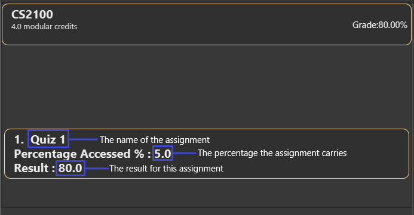

  

        
  **:information_source: Note:**   
     To view the changes made, you have to use the `viewmodule INDEX` command after the `addassignment` command, where `INDEX` refers to the index of the module with the added.
        
  

##### Editing an assignment in a module: `editassignment` (Joshua)

  Edits an assignment at the specified position in the specified module.

  Format: `editassignment` `INDEX` `n/MODULE_NAME` `[a/ASSIGNMENT_NAME]` `[%/ASSIGNMENT_PERCENTAGE]` 
  `[r/ASSIGNMENT_RESULT]`

  * The fields that can be edited are the `ASSIGNMENT_NAME`, `ASSIGNMENT_PERCENTAGE` and `ASSIGNMENT_RESULT`.

  * At least **one** of the optional fields must be present.

  * The index **must be a positive integer** 1, 2, 3...

  Examples:
   * `editassignment 1 n/CS2100 a/Quiz 1` edits the assignment at the first position of the module `CS2100` with a new
   assignment name, `Quiz 1`.

   * `editassignment 1 n/CS2100 %/20 r/80` edits the assignment at the first position of the module `CS2100` with a new
   assignment percentage, `20`% of the final grade, and a new assignment result, `80`.

  

        
  **:information_source: Note:**   
     To view the changes made, you have to use the `viewmodule INDEX` command after the `editassignment` command, where `INDEX` refers to the index of the module with the edited assignment.
        
  

    
##### Deleting an assignment in a module: `deleteassignment` (Joshua)

  Deletes an assignment at the specified position in the specified module.

  Format: `deleteassignment` `INDEX` `n/MODULE_NAME`

  * You can retrieve the index of the assignment list by using the `viewmodule` command to list out the details of the module.

  * The index **must be a positive integer** 1, 2, 3...

  Example:
   * `deleteassignment 1 n/CS2100` deletes the assignment at the first position of the module `CS2100`.

  **:information_source: Note:**   
     To view the changes made, you have to use the `viewmodule INDEX` command after the `editassignment` command, where `INDEX` refers to the index of the module where the assignment was deleted from.
        
  

  
    
##### Adding a grade to a module: `addgrade` (Joshua)

  Adds a grade to the specified module, overwriting the existing grade.

  Format: `addgrade` `n/MODULE_NAME` `g/GRADE`

  * The `MODULE_NAME` must match exactly with an existing module in the module list.

  Example:
   * `addgrade n/CS2100 g/85` adds a grade of `85` to the module `CS2100`.
   
   Expected Outcome: 
     

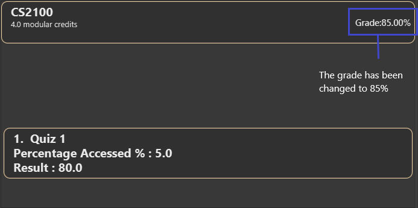

#### Calculating Cumulative Average Point(CAP): `calculatecap`(David)

Calculates your CAP based on completed modules

 Format: `calculatecap`

  Examples:
  * `calculatecap` calculate the user's cap.

#### Calculating target CAP details: `targetcap`(David)

Calculates helpful CAP details based on the target CAP you input

 Format: `targetcap tc/TARGET_CAP`

  * The target cap refers to the desired CAP input by you

  Example:
  * `targetcap tc/4.5` calculates CAP achievement required for planned modules in order to achieve target CAP.

### Todo List Features (Michael)

Todo List allows you to store all of your tasks that you need to accomplish. Before you start learning how to use the commands
for Todo List, it is a good idea to understand the basic features first.

To access the Todo List, you can click the **Tasks** button to change the tab as shown in the picture below.

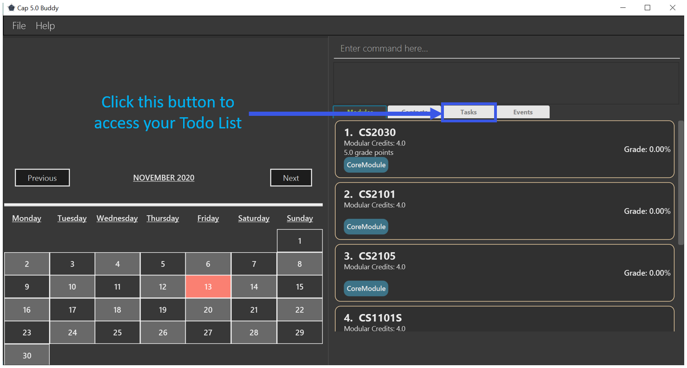

The GUI for Todo List will look like this:

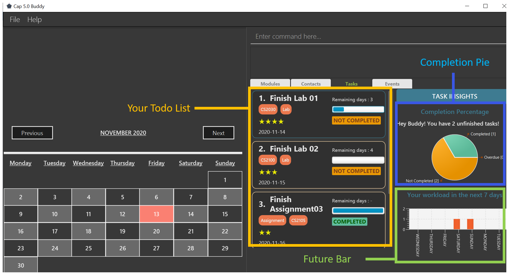

There are 3 big main feature that you can use, which are:

* **Todo List**
  * A **list** that shows all of your tasks.
  
  
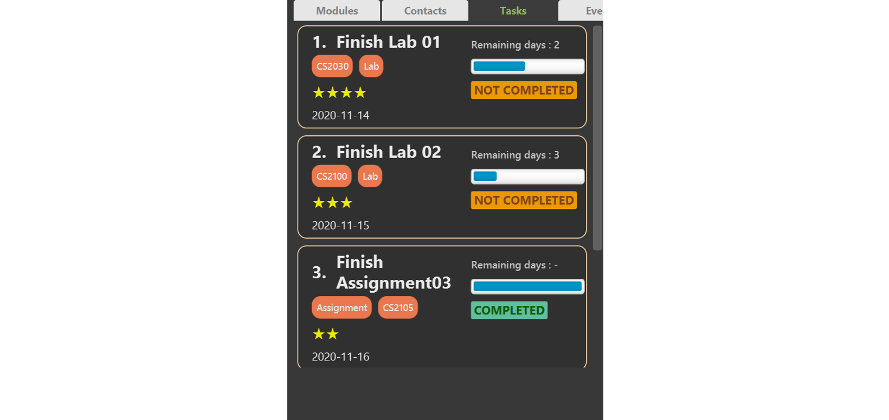

  
* **Completion Pie**
  * A **completion chart** that represents the ratio between completed and not completed tasks.
  
  
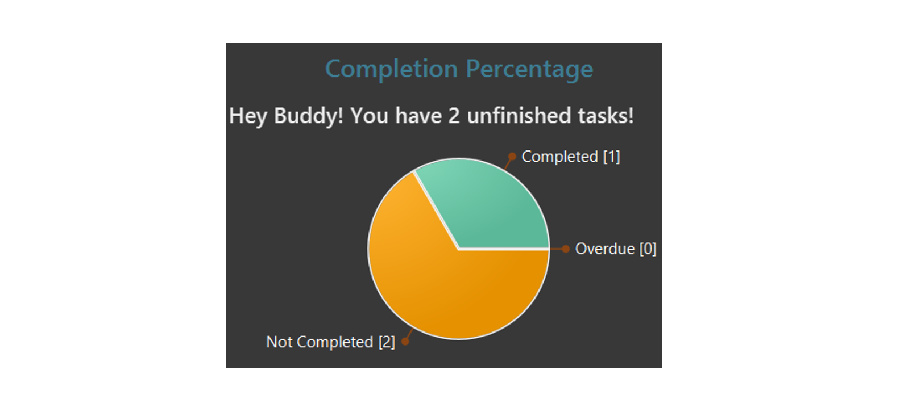

  
* **Future Bar**
  * A **bar chart** that shows your workload in the next 7 days.
  
  
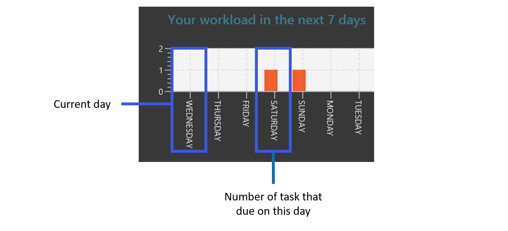

Now that you understand the GUI, let's take a look how you can store your future tasks!

#### What is a Task ? : `Task` (Michael)

A task contains some information that can be useful when you are trying to track all the things that you need to do.

Below is a picture of how each task will look like in the Todo List and what information can be stored:

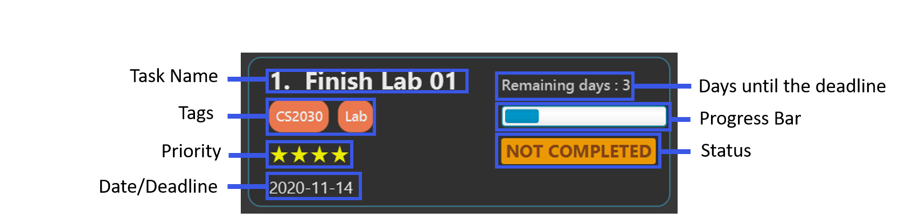

Below are the explanations for each of the information shown above:

* **`TASK_NAME`**

  * Represents the name of a task which can be a short description.
  
  * Task name should contain **30 characters or fewer**.
  
  * **:bulb: Tips :** 
  
  You can set the `TASK_NAME` to be short and clear, for instance, you can name the task as "Finish Lab09".
  This way, you can read through the list much faster.

  * Below are examples for the input:
  
    Input | Display Format
    --------|------------------
    "Finish Lab02" | `Finish Lab02`
    "Submit reflection" | `Submit reflection`
    " &nbsp; Finalize UG" | `Finalize UG` (Preceding whitespaces are ignored)
    "Finalize lab report week 10 for CS2100" | _**Invalid Input**_ (Cannot be longer than 30 characters)

* **`TAG`**

  * Represents a tag that can help describe the type of a task.

  * You can add multiple `TAG`s to each task.
  
  * Each `TAG` can only consist of **one word**.
  
  * **:bulb: Tips :** 
  
  You can set the `TAG` to represent the module that is related to a task.

  * Below are examples for the input:
  
    Input | Display Format
    --------|------------------
    "CS2101" | `CS2101`
    "Assignment" | `Assignment`
    "Review Lecture" | _**Invalid Input**_ (Cannot contain more than 1 word)

* **`PRIORITY`**

  * Represents how important a task is.
  
  * More stars implies that the task is more important.

  * You can choose 3 **pre-defined** priority level, which are,
    * `HIGH` (★★★★)
    * `NORMAL` (★★★)
    * `LOW` (★★) 

  * **:bulb: Tips :** 
  
  Setting a `PRIORITY` for each task can be very handy because later on you will see that you can sort the list
  based on `PRIORITY`!

  * **:information_source: Coming soon!** 
  In the next version of CAP5Buddy, you will be able to add `HIGHEST` (★★★★★) and `LOWEST` (★) priority!

  * Below are examples for the input:
  
    Input | Display Format
    --------|------------------
    "high" | `HIGH`(★★★★)
    "High" | `HIGH`(★★★★)
    "HIGH" | `HIGH`(★★★★)
    "hi" | _**Invalid Input**_ (Input should match the priority name)

* **`DATE`**

  * Represents the date or deadline of a task.
  
  * `DATE` should be in the format YYYY-MM-DD e.g. 2020-11-05.

  * **:bulb: Tips :** 
  
  You can use `DATE` based on your need, for instance, you can set the `DATE` as the deadline of a task or
  a target deadline that is earlier than the real deadline. It's all up to you.

  * Below are examples for the input:

    Input | Display Format
    --------|------------------
    "2020-10-10" | `2020-10-10`
    "2019-10-05" | `2019-10-05`
    "2020-10-3" | _**Invalid Input**_ (Day with a single number should have a preceding `0` i.e. `03`)
    "2020-oct-03" | _**Invalid Input**_ (All values should be in numbers)
    "2020-13-10" | _**Invalid Input**_ (Incorrect value for month)
    "05-10-2018" | _**Invalid Input**_ (Incorrect order)
    "2020-13" | _**Invalid Input**_ (Missing value for day)
    
* **`STATUS`**

  * Represents the status of a task.

  * In normal condition, `STATUS` only has two value which are `COMPLETED` or `NOT COMPLETED`.
  
  * `COMPLETED` will be displayed with a green label, while `NOT COMPLETED` will be displayed with an orange label.

  * When you create a new task, it will have a `STATUS` of `NOT COMPLETED` by default.
  
  * **:warning: Warning:** 
  
  Your task will have the status `OVERDUE` and the progress bar will loop infinitely if you don't 
  complete it by the given deadline.

  * Below are examples for the input:
  
    Input | Display Format
    --------|------------------
    "COMPLETED" | `COMPLETED`
    "Completed" | `COMPLETED`
    "INCOMPLETE" | `NOT COMPLETED`
    "Incomplete" | `NOT COMPLETED`

The following information is not an input type but it is referenced from other information that you have given:

* **`REMAINING DAYS & PROGRESS BAR`**

  * Remaining days tells you how many more days left until the deadline of a task.
  
  * Progress bar tells you the percentage of days that have passed since the day you created the task. In this case, 
  the blue area will increase from day to day.

We have covered the basic feature of Todo List. Next, we will discuss how to use each commands that the Todo List offers.

#### Adding a task: `addtask` (Michael)

This command allows you to add a task to the Todo List.

Format: `addtask n/TASK_NAME [t/TAG]... [p/PRIORITY] [d/DATE]`

* All fields except `TASK_NAME` are **optional**. This means you can leave the details out if you feel it's not necessary.

* You can input the information in any order.

* Task name should contain 30 characters or fewer.

* You can provide more than one `TAG` e.g. `t/LAB t/DAILY`.

* You can choose 3 level of `PRIORITY` i.e. `HIGH`, `NORMAL`, `LOW`.

* Input for `PRIORITY` is not case-sensitive e.g. `highest`, `Highest` work fine.

* `DATE` must be in the form of `YYYY-MM-DD` e.g. `2020-12-05`.

Example(s):

* `addtask n/finish assignemnt t/SCHOOL d/2020-12-10` adds a task with the given information.

Expected output:

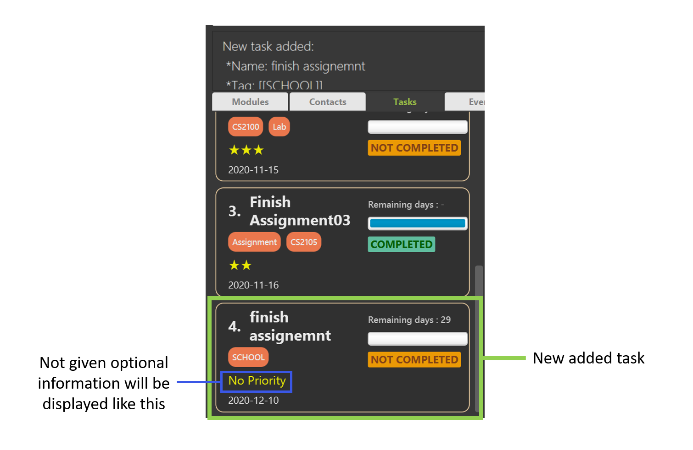

#### Deleting a task: `deletetask` (Michael)

This command allows you to delete a task from the Todo List. You can delete a task by specifying the index of the task
in the TodoList.

Format: `deletetask INDEX`

* `INDEX` must be a **positive whole number** e.g. 1, 2, 10.

* Index must be a **positive whole number** and does not exceed the number tasks in the Todo List.

Example(s):

* `deletetask 3` deletes the third task in the Todo List.

Expected output:

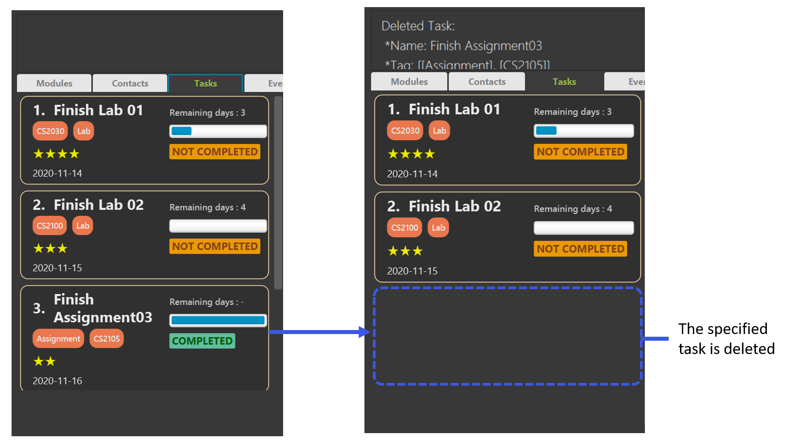

#### Editing a task: `edittask` (Michael)

This command allows you to edit the information stored in a task. With this command you don't need to delete and re-add
a task when you mistakenly input an incorrect information.

Format: `edittask INDEX [n/TASK_NAME] [t/TAG]... [p/PRIORITY] [d/DATE]`

* You can get the `INDEX` from the current displayed Todo List.

* Index must be a **positive whole number** and does not exceed the number tasks in the Todo List.

* You can input the information in any order.

* At least one field must be provided.

* `TASK_NAME` should not be longer than **30 characters**.

* **:information_source: Delete an information from a task:**

  * You can delete an information from a task by specifying the prefix with an empty description.
  
  * Only optional information can be deleted.

* **:warning: Warning:** 

  Editing the `TAG` will overwrite all the current `TAG`s. If you accidentally overwrite the whole tags, you can always
  use the `undo` command. So, don't worry!

Example(s):

Below is an example of editing information of a task:

* `edittask 1 n/read chapter 5 p/normal` edits the first `TASK_NAME` to `read chapter 5` and
and the priority to `normal`.

Expected output:

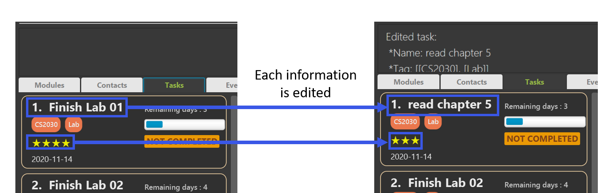

In addition, below is an example of how you can delete information of a task:

* `edittask 1 p/ d/` deletes the `PRIORITY` and the `DATE` of the first task.

Expected output:

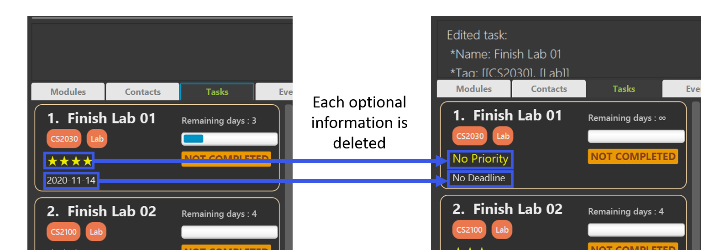

#### Locating tasks: `findtask` (Jonas Ng)

Finds all tasks that fulfil all the provided search criteria.

Format: `findtask [n/NAME_KEYWORDS] [d/DATE] [p/PRIORITY] [s/STATUS] [t/TAG_KEYWORDS]`

 * The search is case-insensitive, e.g. `lab` will match `Lab`.

 * When you are providing name or tag keywords, separate distinct keywords with a whitespace,
   e.g. `findtask n/lab quiz` will search for tasks using the 2 distinct keywords `lab` and `quiz`.

 * You should ensure that search arguments are not blank and at least one search parameter should be provided.

 * Search Parameters:

   * **`Name`**

     * You are allowed to provide multiple name keywords.

     * Tasks with their name matching at least one of the name keywords provided will be considered to have fulfilled the task name search criteria.

     * The order of the search keywords does not matter, e.g. `Lab Quiz` will match `Quiz Lab`.

     * Only full words will be matched, e.g. `lab` will match `lab assignment` but not `labs`.

   * **`Date`**

     * Your search date should be of the format: `YYYY-MM-DD`.

     * You should only provide one search date, i.e. `d/2020-01-01 2020-02-02` would not be accepted.

     * Tasks with their date matching the search date exactly are considered to have fulfilled the task date search criteria.

   * **`Priority`**

     * Your search priority should be one of the following: `highest`, `high`, `normal`, `low` (case-insensitive).
       No other search priority will be allowed.

     * You should only provide one search priority, i.e. `p/highest low` is not allowed.

     * Tasks with their priority matching the search priority exactly are considered to have fulfilled the task priority search criteria.
   
   * **`Status`**
   
     * Your search status should be one of the following: `completed`, `incomplete` (case-insensitive).
     
     * You should only provide one search status, i.e. `s/completed incomplete` is not allowed.
     
     * Tasks with their status matching the search status exactly are considered to have fulfilled the task status search criteria.

   * **`Tag`**

     * You are allowed to provide multiple tag keywords.
     
     * The tag keyword provided should conform to the tag constraint, i.e. should be alphanumeric and should not be blank or contain whitespaces.

     * Task tags will be considered a match only if the tag words are an exact match (case-insensitive),
       e.g. a tag with the word `hard` will match a tag with the word `HARD`, but will not match a tag with the word `harder`.

     * Tasks containing tags which match at least one of the tag keywords provided will be considered to have fulfilled the task tag search criteria.

 * Only tasks matching all search criteria provided will be returned.

 Example(s):
 
 `findtask n/lab p/high` finds all tasks with their name containing the word 'lab' **and** has the priority `high`'.
 
 Expected Outcome:
 
 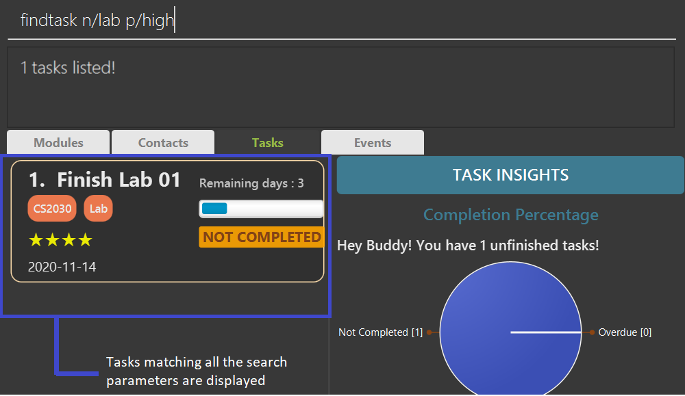
 
 Other helpful examples:

  * `findtask d/2020-10-10 p/high` returns all tasks with the date `2020-10-10` **and** `high` priority.

  * `findtask t/difficult online` returns all tasks that have the `difficult` **or** `online` tag.

  * `findtask n/lab quiz t/difficult` returns all tasks with their name containing **either**
     the word `lab` or  `quiz` **and** has `difficult` as one of its tags.

#### Marking a task as completed: `completetask` (Michael)

This command allows you to label a task as `COMPLETED`. The task will then have the green `COMPLETED` label.

Format: `completetask INDEX`

* You can get the `INDEX` from the current displayed Todo List.

* Index must be a **positive whole number** and does not exceed the number tasks in the Todo List.

* **:bulb: Tips:** 

  You can always change back the status to `Not COMPLETED` by using either the `undo` or `resettask` command.

Example(s):

* `completetask 1` labels the first task in the list as `COMPLETED`.

Expected output:

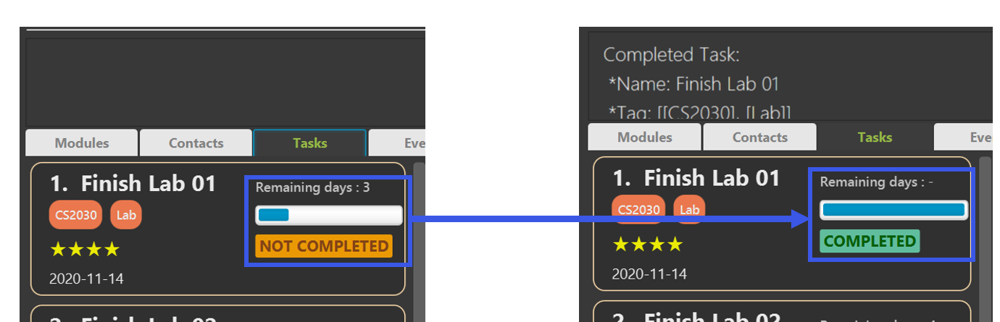

#### Resetting a task: `resettask` (Michael)

This command allows you to reset the status of a task back to `NOT COMPLETED`. The task will then have the red `NOT COMPLETED` label.

Format: `resettask INDEX`

* You can get the `INDEX` from the current displayed Todo List.

* Index must be a **positive whole number** and does not exceed the number tasks in the Todo List.

Example(s):

* `resettask 3` resets the third task in the list.

Expected output:

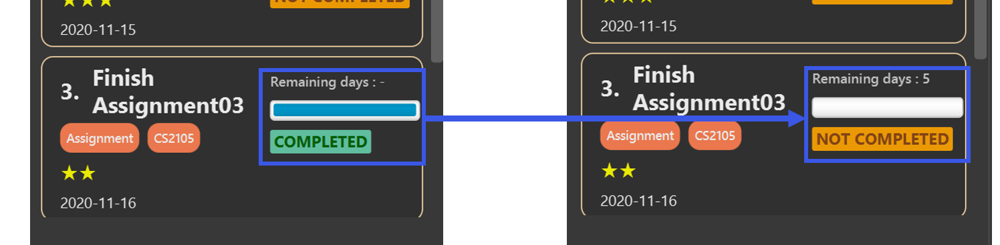

#### Sorting tasks: `sorttask` (Michael)

This command is one of the powerful commands in Todo List. It  allows you to sort the list based on a criterion. In addition,
you will have 3 options when sorting the Todo List which can be very handy, especially to help you become more productive
in managing your tasks.

Format: `sorttask [r] CRITERION`

* `r` indicates if the sorted list should have the reversed order, for example, if `sorttask priority` sorts
  the list from the highest priority to the lowest priority then `sorttask r priority` will sort the list
  from the lowest to the highest priority instead.

* `r` is **optional**. You can use it everytime you need the opposite ordering.

* `CRITERION` is **pre-defined**, you can choose `NAME`, `PRIORITY`, or `DATE`.

* `CRITERION` is not case-sensitive e.g `priority, PRIORITY` work fine.

* **:bulb: Tips:** 
  * Each `CRITERION` has an abbreviated or synonym version that you can use:
    * You can input `NAME` as `n` (not case-sensitive).
    * You can input `PRIORITY` as `prior` or `p` (not case-sensitive).
    * You can input `DATE` as `deadline`, `d` (not case-sensitive).
  * Using these abbreviations, the process become less tedious, and you can sort the Todo List much faster. 

Example(s):

* `sorttask priority` sorts the Todo List from the task with the highest priority to the task with the lowest or no priority.

Expected output:

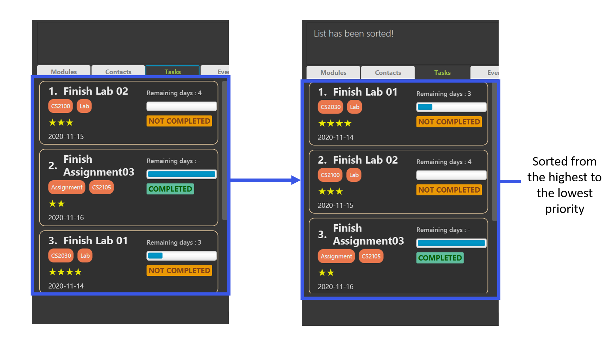

#### Listing all tasks: `listtask` (Michael)

This command allows you to list all the tasks on the list, and also resets the ordering at the same time.

Format: `listtask`

* **:bulb: Tips:**  

  You can use `listtask` to go back to the original list after
  performing a `findtask` or `sorttask` command.

Example(s):

* `listtask` resets the current displayed Todo List to the original list.

Expected output:

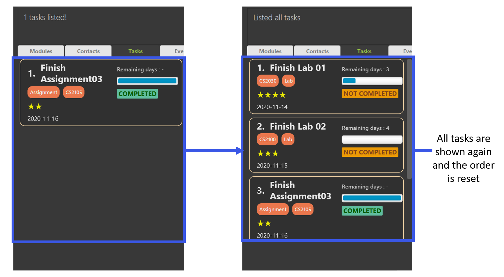

#### Clearing the list: `cleartask` (Michael)

This command allows you to clear all tasks in the Todo List.

Format: `cleartask`

* **:warning: Warning:** 
  * We recommend you to do a backup before proceeding to clear the whole Todo List as there is no auto-backup feature
    in this current version of CAP5BUddy.
  * If you accidentally cleared the whole list, you can always use the `undo` command to restore the Todo List. However,
    you should always remember that the `undo` command is only able to undo a limited amount of commands.

Example(s) :

* `cleartask` deletes the whole TodoList.

Expected output:

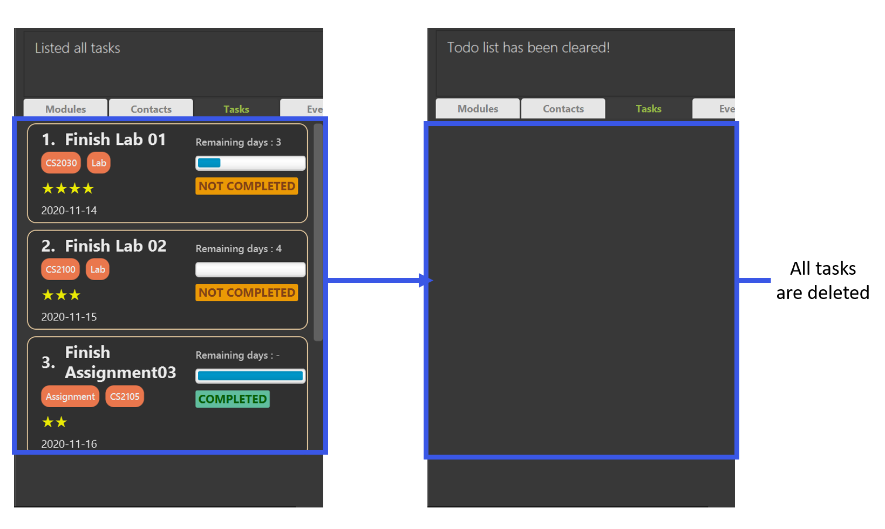

Finally, we have covered all of the Todo List commands, and now you are ready to be a pro in task managing!

### Contact List Features (Jonas Ng)

The following features allow you to manage a list of contacts and perform various contact related functions. 

The section below provides some useful details about the contact list features.

#### Contact command parameters (Jonas Ng)

A contact list feature can use one or more of the following parameters:

* **`NAME`**:

   * Represents the name of a contact.
  
   * Can only contain alphanumeric characters and spaces, and should not be blank.
  
   * Examples: `John`, `Amy`.
  
   * All contacts must have a name.
  

* **`EMAIL`**:

   * Represents the email address of a contact.
  
   * `Email`should be of the format `local-part@domain` and adhere to the following constraints:
       
     1. The local-part should only contain alphanumeric characters and these special characters: `!#$%&'*+/=?{|}~^.-` .
         
     2. This is followed by a `@` and then a domain name. 
         
     3. The domain name must:
        * Be at least 2 characters long.
        * Start and end with alphanumeric characters.
        * Consist of alphanumeric characters, a period or a hyphen for the characters in between, if any.

   * Example: `johndoe@gmail.com`.

   * All contacts must have an email address.

* **`TELEGRAM`**:

  * Represents the telegram username of a contact.
  
  * The `TELEGRAM` field provided must be a valid telegram username that follows the following constraints:
  
    1. Must start with the `@` symbol.
    2. At least 5 characters long, not including the `@` symbol.
    3. Contains only alphanumeric characters or underscore.
    
  * Examples: `@john_doe`, `@johndoe`.
  
  * Telegram is a not a compulsory field of a contact.

* **`TAG`**:

  * Represents a tag that can be used to describe a contact.
  
  * Tags names should be alphanumeric and should not be blank or contain whitespaces.
  
  * Examples: `friend`, `TA`.
  
  * Tag is not a compulsory field of a contact.

#### Adding a contact: `addcontact` (Jonas Ng)

Adds a new contact into the contact list if it does not already exist.

Format: `addcontact n/NAME e/EMAIL [te/TELEGRAM] [t/TAG]...`

 * A contact can have any number of tags (including 0).

Example(s): 

`addcontact n/Amy e/Amy@gmail.com te/@Amytele t/friend` adds a new contact with the name `Amy`, email `Amy@gmail.com`, telegram `@Amytele` and a tag `friend`.
 
Expected Outcome:

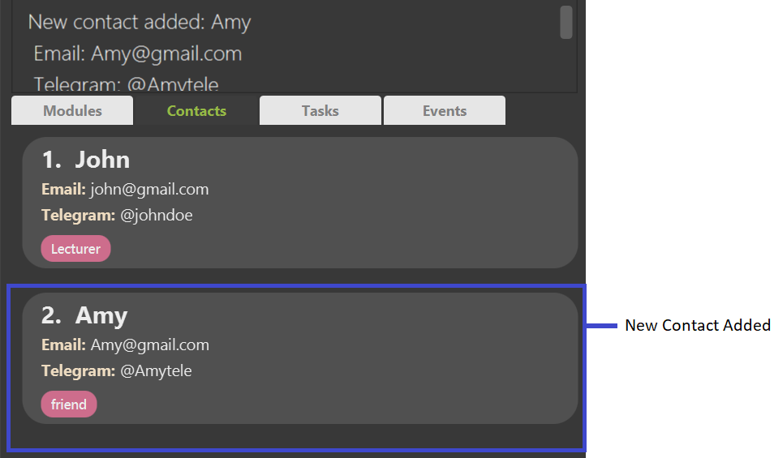

Other helpful example(s):

`addcontact n/John e/John@gmail.com t/coworker` adds a new contact with the name `John`, email `John@gmail.com` and a tag `coworker`.

#### Locating contacts: `findcontact` (Jonas Ng)

 Finds all contacts that fulfil all the provided search criteria.

 Format: `findcontact [n/NAME_KEYWORDS] [t/TAG_KEYWORDS]`

  * The search is case-insensitive, e.g. `bob` will match `Bob`.

  * You are allowed to provide multiple search keywords for both the name and tag parameter.

  * The order of the search keywords does not matter, e.g. `Bob Abramham` will match `Abraham Bob`.

  * When you are providing name or tag keywords, separate distinct keywords with a whitespace,
    e.g. `findcontact n/bob abraham` will search for contacts using the 2 distinct keywords `bob` and `abraham`.

  * You should ensure that keywords are not be blank and at least one search parameter should be provided.

  * Search Parameters:

    * Name

      * Contacts with their name matching at least one of the name keywords provided will be considered to have fulfilled the contact name search criteria.

      * Only full words will be matched, e.g. `Bob` will match `Bob Abraham` but not `Bobs`.

    * Tag

      * Contacts containing tags which match at least one of the tag keywords provided will be considered to have fulfilled the contact tag search criteria.

      * Contact tags will be considered a match only if the tag words are an exact match (case-insensitive),
        e.g. a tag with the word `friend` will match a tag with the word `FRIEND`, but will not match a tag with the word `friendly`.
      
      * The tag keyword provided should conform to the tag constraint, i.e. should be alphanumeric and should not be blank or contain whitespaces.

  * Only contacts matching all search criteria provided will be returned.

  Example(s): 
  
  `findcontact n/amy` finds all contacts with the word `amy` in their name.
  
  Expected Outcome: 
  
  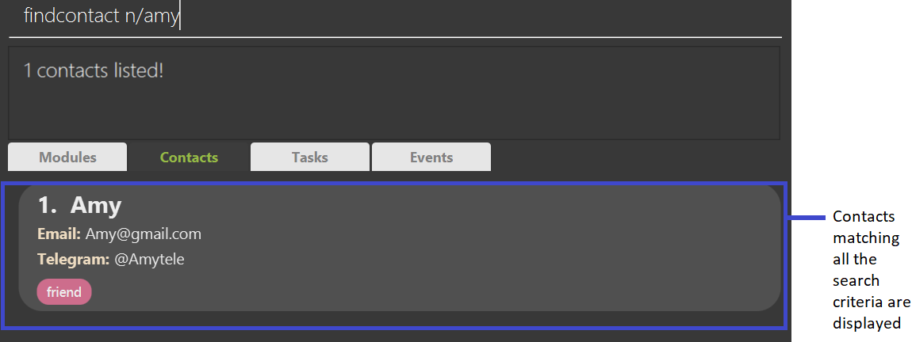
  
  Other helpful example(s):

   * `findcontact n/Bob Abraham` returns all contacts with the word `Bob` **or** `Abraham` in their name, e.g. `Bob Lim`, `Tommy Abraham`.

   * `findcontact t/friend coworker` returns all contacts that have the `friend` **or** `coworker` tag.

   * `findcontact n/john t/friend` returns all contacts with the word `john` in its name **and** has `friend` as one of its tags.

#### Listing all contacts: `listcontact` (Jonas Ng)

 Shows a list of all contacts in the contact list.

 Format: `listcontact`

 

 **:bulb: Tip:** 

 `listcontact` is a useful command that you can use to display the original contact list.
  e.g. after using the `findcontact` or `sortcontact` commands.

 

 
 Example(s): 
 
 `listcontact`
 
 Expected Outcome: 
 
 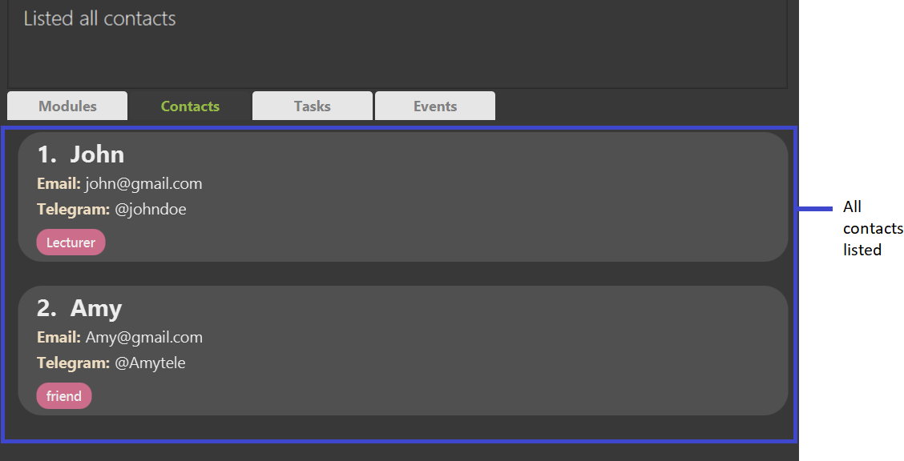

#### Editing a contact: `editcontact` (Jonas Ng)

 Edits an existing contact in the contact list.

 Format: `editcontact INDEX [n/NAME] [e/EMAIL] [te/TELEGRAM] [t/TAG]...`

 * Edits the contact at the specified `INDEX`. The index refers to the index number of the contact shown
   in the displayed contact list. The index **must be a positive integer** 1, 2, 3...

 * At least one of the optional fields must be provided.

 * Existing values will be updated to the input values.
 
 * If the contact has an existing telegram field, you can remove it by typing `te/` without specifying any telegram field after it, i.e. `editcontact 1 te/`.

 * When editing tags, the existing tags of the contact will be removed i.e adding of tags is not cumulative.

 * You can remove all the contact’s tags by typing `t/` without specifying any tags after it, i.e. `editcontact 1 t/`.

 Example(s): 
 
 `editcontact 2 n/amy lee e/amy-lee@gmail.com t/classmate` edits the second contact in the displayed contact list with the name `amy lee`, email `amy-lee@gmail.com` and tag `classmate`.
 
 Expected Outcome: 
 
 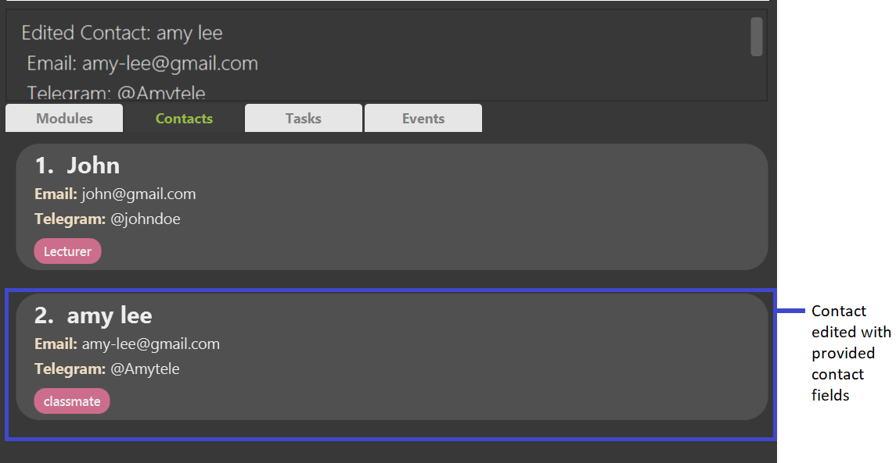

 Other helpful example(s):
 
 `editcontact 2 t/` edits the second contact in the displayed contact list by removing all tags of that contact.

 `editcontact 2 n/john te/` edits the second contact in the displayed contact list with the name `john` and removes the telegram detail of that contact.
 

#### Deleting a contact: `deletecontact` (Jonas Ng)

Deletes the specified contact from the contact list.

Format: `deletecontact INDEX`

 * Deletes the contact at the specified `INDEX`.

 * The index refers to the index number of the contact shown on the displayed contact list.

 * The index **must be a positive integer** 1, 2, 3...

Example(s): 

`deletecontact 2` deletes the second contact in the displayed contact list.

Expected Outcome: 

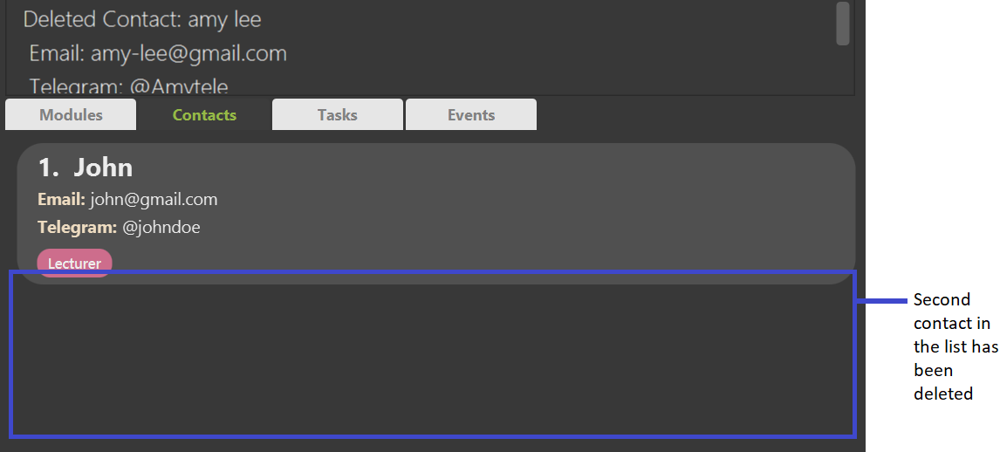

Other helpful example(s):

`deletecontact 5` deletes the fifth contact in the displayed contact list.

#### Sorting contacts: `sortcontact`

Sorts the list based on the name of the contact lexicographically.

Format: `sortcontact` `[r]`

* `r` indicates if the sorted list should have reversed order.

* `r` is **optional**.

Examples:

* `sortcontact` might produce a list of `{michael, sasha}`.

* `sortcontact r` might produce a list of `{sasha, michael}`.

#### Marking contacts as important: `importantcontact` (Michael)

Marks a task as `Important`.

Format: `importantcontact` `INDEX`

* You can get the `INDEX` from the current displayed list under the `Contacts` tab.

* `INDEX` must be a **positive integer**.

* _**Tips :**_ You remove important mark from contact by using either the `undo` or `resetcontact` command.

Examples:

* `importantcontact 1` marks the first contact in the list as `Important`.

* `importantcontact 2` mark the second contact in the list as `Important`.

#### Resetting contacts: `resetcontact` (Michael)

Removes a contact's important mark and replaces it with `Not Important` (default).

Format: `resetcontact` `INDEX`

* You can get the `INDEX` from the current displayed list under the `Contacts` tab.

* `INDEX` must be a **positive integer**.

Examples:

* `resetcontact 1` marks the first contact in the list as `Not Important`.

* `resetcontact 2` mark the second contact in the list as `Not Important`.

#### Clearing the contact list: `clearcontact` (Jonas Ng)

Clears all contacts in the contact list.

Format: `clearcontact`

 **:bulb:** 

 If you accidentally cleared the whole contact list, you can always use the `undo` command
 to restore the list.

 

Example(s): 

`clearcontact`

Expected Outcome:  
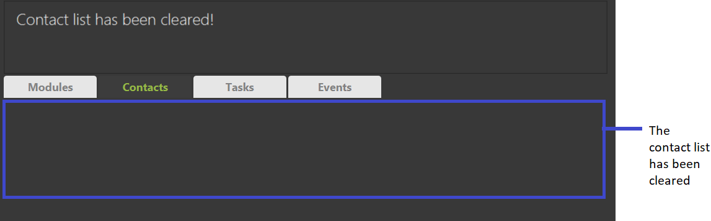

### Scheduler Features

#### Adding an Event to the Scheduler: `addevent`

Creates and add a new Event with the specified information from the user input

  Format: `addevent n/EVENT_NAME d/DATE_TIME [t/TAG]`

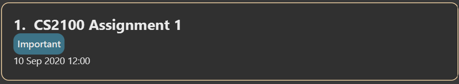

   Examples:
    * `addevent n/CS2100 Assignment 1 d/10-9-2020 1200 t/Important` adds an Event called C2100 Assignment 1 with the deadline of 10-9-2020 1200 and the tagging of Important.(Expected result shown in above image.)
    * `addevent n/CS2103T exams d/12-12-2020 1200` adds an Event called CS2103T into the Scheduler with the date 12-12-2020.
    * `addevent n/CS2103T exams d/12-12-2020 1200 t/Important` adds an Event called CS2103T into the Scheduler with the date 12-12-2020 and the tag of Important.
    * `addevent n/CS2103T exams d/12-12-2020 1200 t/Important t/Urgent` adds an Event called CS2103T into the Scheduler with the date 12-12-2020 and the tag of Important and Urgent.

#### Deleting an Event from the Scheduler: `deleteevent`

You can delete an existing event from the list by specifying the index.

  Format: `deleteevent index`

   Example:
    * `deleteevent 1` deletes the event of index 1 from the EventList.

#### Editing an Event from the Scheduler: `editevent`

You can select an existing event from the list and modify the information such
as event name and the event date.

  Format: `editevent index [n/new name] [d/new date]` 
  **Note:** All fields are optional but at least 1 of them must be present.

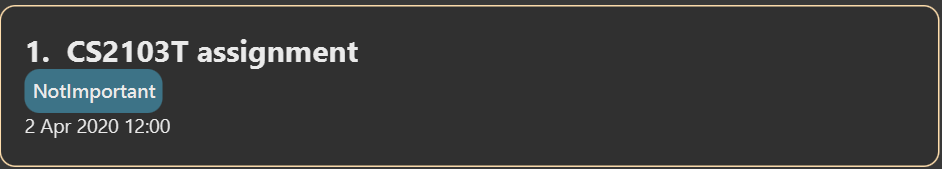

   Examples:
    * `editevent 1 n/CS2103T assignment d/2-4-2020 1200 t/NotImportant` edits the event of index 1 with the new name of CS2103T, new date and time of 2-4-2020 1200 and the new tag of NotImportant. (Expected result shown in above image.)
    * `editevent 1 n/CS2100` edits the event of index 1 with the new name of CS2103T.
    * `editevent 1 d/3-3-2020 1300` edits the event of index 1 with the new date time of 3-3-2020 1300.
    * `editevent 1 t/NotImportant` edits the event of index 1 with the new tag of Not Important.

#### Finding an Event from the Scheduler: `findevent`

You can search for a particular event based on the name and date. This will return you a list of all events that have these keywords.

  Format: `findevent [n/EVENT_NAME] [d/DATE_TIME]`
  **Note:** All fields are optional but at least 1 of them must be present.

   Examples:
    * `findevent n/CS2103T` finds all events that have **CS2103T** in their event name.
    * `findevent d/1-1-2020 1200` finds all event that have the date and time of **1 Jan 2020 12:00**.

#### List events: `listevent`

Allows you to view all events.

Format: `listevent`

 Examples:
 * `listevent` Views the event list on the display.

### General Features

#### Undo previous user command: `undo`(David)

Undoes the previous user command

* You can undo any command that has changed any stored details

 Format: `undo`
 
  Example:
  * `undo`

#### Redo previous user command: `redo`(David)

Redoes the previously undone user command

 Format: `redo`
 
  Example:
  * `redo`

#### Exiting the application: `exit`(David)

Exits CAP5Buddy

Format: `exit`

  Example:
  * `exit`

#### Getting help : `help`(Team)

Opens the help window

Format: `help`

  Example:
  * `help`
  
## FAQ

**Q**: How do you add a module into the program? 
**A**: Run the program and wait for the terminal to start up. Next, type in : “addmodule n/CS2103T” to add a module called CS2103T.

**Q**: How do you view the zoom links of a particular module? 
**A**: When the program has started running, enter the following in the terminal : “viewmodule 1” to view the zoom link for the first module in the displayed list.

**Q**: How do you edit a module's information?
**A**: When the program is running, you can enter the edit command and enter whichever field you want to modify but at least
1 field must be present.

**Q**: How do I save all the module related information I have entered?
**A**: All information and details entered will be automatically stored and can be accessed the next time you start the application.
--------------------------------------------------------------------------------------------------------------------

## Command Summary for Module Tracker(David,Jonas,Joshua,Matthias)

Action | Format, Examples
--------|------------------
**Add Module** | `addmodule n/MODULE_NAME`  e.g. `addmodule n/CS2103T`
**Add Completed Module** | `addcmodule n/MODULE_NAME mc/MODULAR_CREDITS gp/GRADE_POINT [t/TAG]...`  e.g. `addcmodule n/CS2101 mc/2.0 gp/4.5 t/year1`
**View Module** | `viewmodule INDEX`  e.g. `viewmodule 2`
**Delete Module** | `deletemodule INDEX`  e.g. `deletemodule 3`
**Edit Module** | `editmodule INDEX n/NEW_NAME [mc/MODULAR_CREDITS] [gp/GRADE_POINT] [t/TAG]...`  e.g. `editmodule 2 n/CS2103T gp/4.5`
**Clear Module List** | `clearmodule`  e.g. `clearmodule`
**Add Zoom to module** | `addzoom INDEX n/LESSON_NAME z/ZOOM_LINK`   e.g. `addzoom 1 n/lecture z/https://nus-sg.zoom.us/j/uascya367yfy`
**Add Assignment** | `addassignment n/MODULE_NAME a/ASSIGNMENT_NAME %/ASSIGNMENT_PERCENTAGE r/ASSIGNMENT_RESULT`   e.g. `addassignment n/CS2100 a/Quiz 1 %/5.0 r/80`
**Edit Assignment** | `editassignment INDEX n/MODULE_NAME [a/ASSIGNMENT_NAME] [%/ASSIGNMENT_PERCENTAGE] [r/ASSIGNMENT_RESULT]`   e.g. `editassignment 1 n/CS2100 a/Quiz 3 %/20.0`
**Delete Assignment** | `deleteassignment INDEX n/MODULE_NAME`   e.g. `deleteassignment 1 n/CS2100`
**Add Grade** | `addgrade n/MODULE_NAME g/GRADE`   e.g. `addgrade n/CS2100 g/90`
**Archive** | `archivemodule INDEX `  e.g. `archivemodule 3`
**Un-archive** | `unarchivemodule INDEX `  e.g. `unarchivemodule 3`
**Archive Module** | `archivemodule INDEX `  e.g. `archivemodule 3`
**Un-archive Module** | `unarchivemodule INDEX `  e.g. `unarchivemodule 3`
**View Archived Module List** | `viewarchive `  e.g. `viewarchive`
**View Un-archived Module List** | `listmodule `  e.g. `list`
**Calculate CAP** | `calculatecap`   e.g. `calculatecap`
**Calculate Target CAP details** | `targetcap tc/TARGET_CAP`   e.g. `targetcap 4.5`

## Command Summary for Contact List (Jonas Ng)

Action | Format, Examples
-------|-------------------------
**Add Contact** | `addcontact n/NAME e/EMAIL [te/TELEGRAM] [t/TAG]...`   e.g. `addcontact n/john e/john@gmail.com te/@johndoe t/friend`
**Edit Contact** | `editcontact INDEX [n/NAME] [e/EMAIL] [te/TELEGRAM] [t/TAG]...`   e.g. `editcontact 1 n/amy te/@amytele`
**Find Contact** | `findcontact [n/NAME_KEYWORDS] [t/TAG_KEYWORDS]`   e.g. `findcontact n/john`
**Delete Contact** | `deletcontact INDEX`   e.g. `deletecontact`
**List Contacts** | `listcontact`
**Sort Contacts** | `sortcontact`
**Mark Contact as Important** | `importantcontact INDEX`   e.g. `importantcontact 1`
**Mark Contact as unimportant** | `resetcontact INDEX`   `resetcontact 1`
**Clear Contact**  | `clearcontact`

## Command summary for Todo List (Michael)

Action | Format, Examples
--------|------------------
**Add Task** | `addtask n/TASK_NAME [t/TAG]... [p/PRIORITY] [d/DATE]`
**Edit Task** | `edittask INDEX [n/TASK_NAME] [t/TAG]... [p/PRIORITY] [d/DATE]`
**Find Task** | `findtask [n/NAME_KEYWORDS] [d/DATE] [p/PRIORITY] [s/STATUS] [t/TAG_KEYWORDS]`
**Delete Task** | `deletetask INDEX`
**List Tasks** | `listtask`
**Sort Tasks** | `sorttask [r] CRITERION`
**Label Task as Completed** | `completetask INDEX`
**Label Task as Not Completed** | `resettask INDEX`
**Clear Tasks** | `cleartask`

## Command summary for Scheduler

Action | Format, Examples
-------|-------------------------
**Add Event** | `addevent n/EVENT_NAME d/DATE_TIME [t/TAG]`   e.g. `addevent n/CS2103T d/12-2-2020 t/Important`
**Delete Event** | `deleteevent index`   e.g. `deleteevent 1`
**Edit Event** | `editevent index [n/EVENT_NAME] [d/DATE_TIME] [t/TAG]`   e.g. `editevent 1 n/CS2100 d/2-1-2020 t/Done`
**Find Event** | `findevent [n/EVENT_NAME] [d/DATE_TIME]`   e.g. `findevent n/CS2103T`
**List Event** | `listevet`   e.g. `listevent`

## Command summary for general features(David)

Action | Format, Examples
--------|------------------
**Undo** | `undo`   e.g. `undo`
**Redo** | `redo`   e.g. `redo`
**Exit** | `exit`   e.g. `exit`
**Help** | `help`   e.g. `help`
